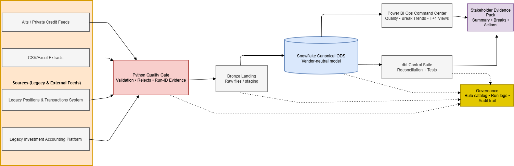

# Architecture Walkthrough — Future-State Investment Data Hub (NDA-safe)

## Visual blueprint
Insert the exported diagram here once you export it from draw.io:

---

## What this architecture is designed to achieve
This blueprint shows a practical pattern for modernizing investment data into a cloud analytics stack while protecting the three things Finance cares about most:

- **NAV integrity** (valuations tie-out and controlled changes)
- **Income integrity** (accruals, coupons/dividends, FX effects)
- **Cash integrity** (cash movements reconcile and timing is explainable)

The approach assumes source data is imperfect and builds controls **early** so issues are found before they become downstream breaks.

---

## End-to-end flow (one sentence)
**Sources → Quality Gate → Raw Landing (Bronze) → Canonical ODS → Controls/Reconciliation → Reporting & Evidence, with Governance throughout.**

---

## Layer-by-layer walkthrough

### 1) Source layer (legacy + external feeds)
**What it is**
A mix of operational and accounting inputs, typically including:
- Legacy investment accounting exports (positions, transactions, income, cash)
- Positions and transactions feeds (operational views)
- CSV/Excel extracts used for fixes, supplements, or one-off reporting
- Alternatives / private credit feeds (often slower cadence, less standardized)

**Common risks**
- Inconsistent identifiers (security, account, entity, currency)
- Missing or invalid terms (coupon rate, day count, maturity, factor)
- Bad dates (settle before trade, future effective dates, gaps)
- Data that “looks valid” structurally but breaks financial logic

**Control principle**
Treat every source as **untrusted** until it passes validation and produces evidence.

---

### 2) Python Quality Gate (validation + rejects + run evidence)
**Role**
A controlled entry point that blocks bad records from contaminating the warehouse.

**What it does**
- Applies finance-aware checks (not just “is it null?”)
- Produces two streams:
  - **Clean**: records that meet required quality rules
  - **Rejects**: quarantined records with reason codes for remediation
- Writes a **run summary** (counts by rule, pass rate, run-id)

**Why it matters**
Most downstream “reconciliation issues” are actually **data quality issues**. Catching them here reduces rework later and prevents misleading reporting.

---

### 3) Bronze landing (raw files / staging)
**Role**
A replayable raw layer that preserves what arrived for that run.

**What it typically contains**
- Raw/near-raw snapshots per run (files or staging tables)
- Minimal transformations (structure/typing only)
- Run metadata (run-id, load timestamp, source tag)

**Why it matters**
When a break appears later, you can answer:
- What exactly arrived in this run?
- Did the source change?
- Did the rule set change?
- Is this a new defect or historical drift?

---

### 4) Canonical ODS (Snowflake, vendor-neutral model)
**Role**
A clean, standardized “operational data store” that becomes the stable foundation for analytics and controls.

**What it does**
- Normalizes data into consistent tables and keys (vendor-neutral)
- Separates concerns:
  - Reference/master data (instruments, entities, accounts)
  - Events/transactions (trades, cash movements, corporate actions)
  - Positions/balances (holdings, lots, cost, accrual balances)
- Establishes consistent relationships so reporting and testing do not depend on vendor schemas

**Why it matters**
If the ODS is stable, you can:
- plug in new sources without redesigning reporting
- keep controls consistent across migrations and upgrades
- reduce vendor lock-in at the data layer

---

### 5) Controls & reconciliation (dbt control suite)
**Role**
Automated checks that compare expected financial behavior and highlight breaks with structure.

**Typical controls (examples)**
- Completeness: key fields present for each asset type / event type
- Balancing: cash movements reconcile to expected postings/flows
- Consistency: positions align with transaction history and terms
- Parallel-run checks: legacy results vs target results (where applicable)

**How breaks are handled**
Breaks are not just flagged; they’re grouped into a practical taxonomy, for example:
- **Timing** (same event captured on different dates/cutoffs)
- **Rounding** (minor precision differences)
- **Data defect** (missing/wrong attributes or identifiers)
- **Logic defect** (calculation or mapping error)

This structure speeds up triage and prevents “endless break lists.”

---

### 6) Reporting layer (Power BI ops command center)
**Role**
A management view that turns raw control results into operational visibility.

**What it typically shows**
- Data quality pass rate over time
- Top rejection reasons and affected domains
- Break trends by category and materiality
- Timeliness/cutoff monitoring patterns (useful under faster operating models)

**Why it matters**
Stakeholders do not want raw logs. They want:
- what changed
- what broke
- what’s being done about it
- whether the trend is improving

---

### 7) Stakeholder evidence pack (summary, breaks, actions)
**Role**
A repeatable artifact for governance, steering committees, audit needs, and cutover readiness.

**Typical contents**
- Run date + run-id
- Records processed, pass rate
- Top issues (rejections and material breaks)
- Actions and owners (what is being fixed, by whom, by when)

**Why it matters**
Modernization programs often fail due to weak evidence and weak control narratives. This package makes progress measurable.

---

### 8) Governance thread (rule catalog, run logs, audit trail)
**Role**
The control backbone that ties everything together.

**Includes**
- Versioned rule catalog (what rules exist, what changed, why)
- Run logs (what ran, when, inputs, outputs)
- Evidence retention (summaries, reject extracts, break reports)
- Change control notes for mappings and metrics

**Why it matters**
Governance is how you keep the future-state stable when:
- source systems change
- business rules evolve
- new asset classes and feeds are added

---

## How this demo maps to real programs (without sharing confidential implementation)
This demo is intentionally NDA-safe. In real engagements, the same pattern is applied with:
- controlled access to source extracts and approvals
- documented mapping decisions and sign-offs
- scheduled control execution with ownership and escalation
- retained evidence for audit and operational readiness

The goal is not “a warehouse.” The goal is a **repeatable migration control system** that makes results trustworthy.
